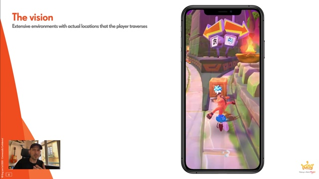

# The Environments of Crash Bandicoot: On the Run! | King | Houdini HIVE GameDev

クラッシュバンディグー オン ザ ラン！の背景

## 概要

https://www.youtube.com/watch?v=wx3lDVDIrqQ

Crash Bandicoot: On The Run! is King's first released game that relies heavily on Houdini for its environments and during prototyping phase. This talk focuses on the 18 month evolution of the tools as a process of discovery that involved tech and art working close and would go from refinement to profound shifts in mindset and data layout.

Miguel Mendez spent nine years in the Flight simulation industry where he used Houdini to build Large scale environment data sets before moving to King in 2017, where he works as a Snr Technical Artist.  Miguel's focus in on the creation of efficient content pipelines and he uses his previous experience to help drive procedural workflows within the company ensuring scalability for Art content.

## アウトライン

00:00:00 始めに ＆ ゲームトレーラー
00:03:41 ゲームのビジョン
00:06:07 六角形タイルシステムの導入
00:12:15 六角形タイルをプロシージャルに
00:24:07 最終結果

