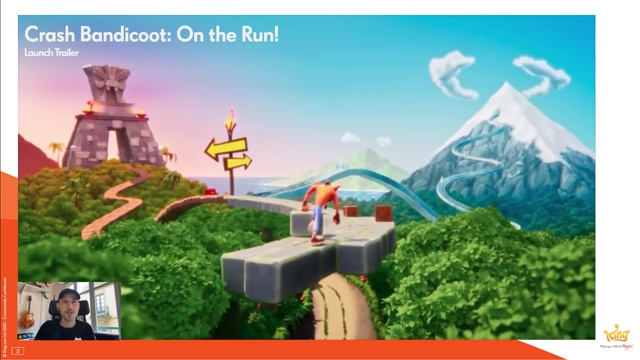
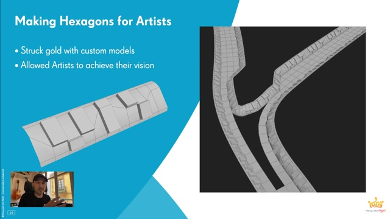
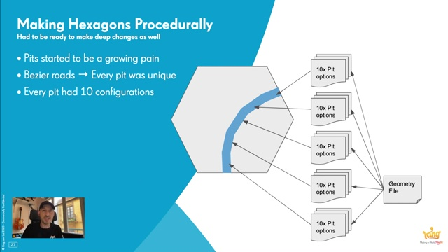
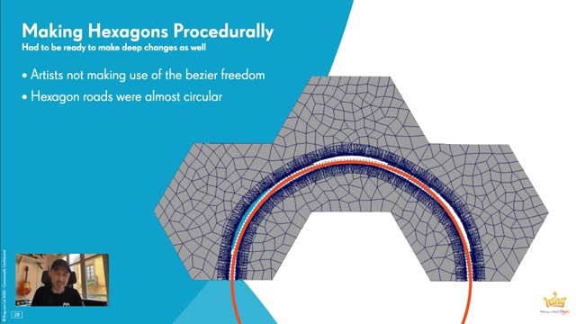

# The Environments of Crash Bandicoot: On the Run! | King | Houdini HIVE GameDev

クラッシュバンディグー オン ザ ラン！（キング）の背景

邦題：クラッシュ・バンディクー ブッとび！マルチワールド [Android版](https://play.google.com/store/apps/details?id=com.king.crash) [iOS版](https://apps.apple.com/jp/app/crash-bandicoot-on-the-run/id1510334752)

Kingはキャンディークラッシュサーガ・バブルウィッチなど主にパズルゲーム系で有名な会社だが、マップ画面の作成などで今までもHoudiniを使ってはいた。今回初の本格的３Dゲームをリリースし、Houdiniも本格的に使いだしたように見える。
https://apps.apple.com/jp/developer/king/id526656015#see-all/i-phonei-pad-apps

## 概要

https://www.youtube.com/watch?v=wx3lDVDIrqQ

クラッシュバンディグー オン・ザ・ラン！ は開発のプロトタイピング作成や実際の背景製作の際、King内で初めて本格的にHoudiniを利用して作られリリースされたゲームです。

この動画では18か月にわたる、テク二カルとアートの密接な共同作業を促した知見の過程としてのツールの進化に注目します。さらにデータ方式とその考え方について、改善からの大きな変化にも注目します。

Miguel Mendez は2017年にKingに移籍してシニアテクニカルアーティストとして働き出す前、フライトシミュレーションの業界で9年の業務経験を持ち、そこでHoudiniを大スケールの背景データセット作成に利用していました。

Miguelは効果的なコンテンツパイプラインの製作に注力しました。前職での経験を利用し、プロシージャルワークフローがKing内のアートコンテンツがスケーラビリティを持てるようにしました。

## 動画アウトライン

### ゲームトレーラー

[00:01:14](http://www.youtube.com/watch?v=wx3lDVDIrqQ?t=74s)

### ゲームのビジョン
[00:03:41](http://www.youtube.com/watch?v=wx3lDVDIrqQ?t=221s) 

コンセプトアート。広大な情景の中に実際にプレイヤーが走り抜ける場所を設ける。

### 古典的な技法を試した

### 様々な地形

### プロトタイプで試したこと

### 六角形も試した

### Unity上でHDAを動かしてみた

### 六角形タイルシステムを導入
[00:06:07](http://www.youtube.com/watch?v=wx3lDVDIrqQ?t=367s) 

### プロシージャル化しすぎて失敗

### デザイナのために六角形タイルを用意する
[00:12:15](http://www.youtube.com/watch?v=wx3lDVDIrqQ?t=735s) 

### デザイナの作業を取り込む

デザイナ手作業のモデルを取り込むようにして、これはとてもうまくいった。

### 見出し未定

### 見出し未定

### 見出し未定

### 見出し未定

### 見出し未定

### 最終結果 タイル例
[00:24:07](https://youtu.be/wx3lDVDIrqQ?t=1447s) 

### 最終結果 シーン例

## 考察

視聴してのまとめ。

デザイナ作業とプロシージャルパイプラインの融合について

