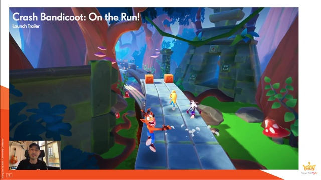
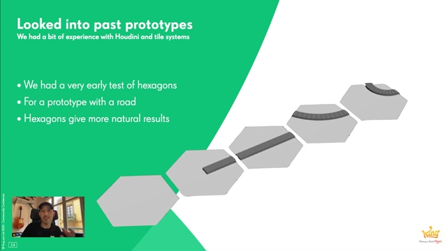
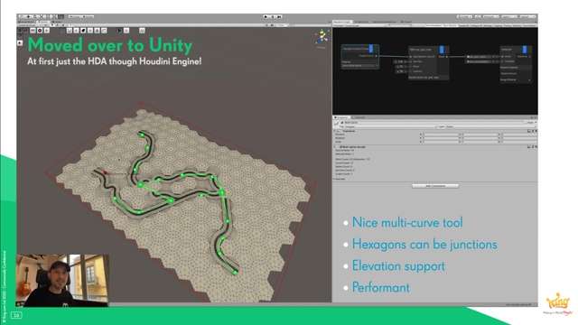
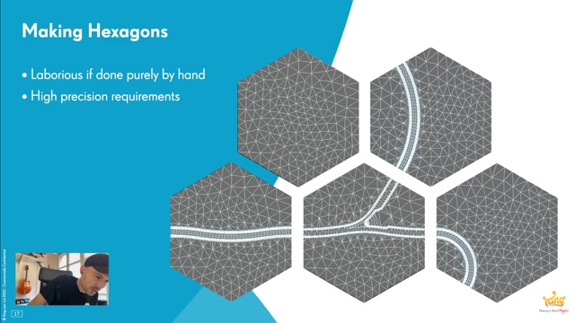
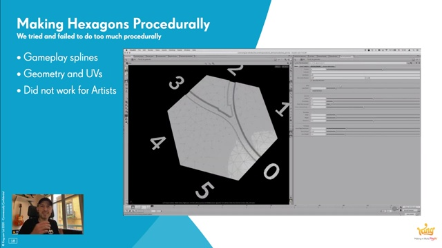
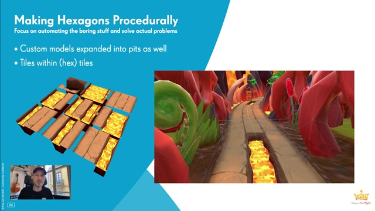

# The Environments of Crash Bandicoot: On the Run! | King | Houdini HIVE GameDev

クラッシュバンディグー オン ザ ラン！（キング）の背景

## 概要

https://www.youtube.com/watch?v=wx3lDVDIrqQ

クラッシュバンディグー オン・ザ・ラン！ は開発のプロトタイピング作成や実際の背景製作の際、King内で初めて深くHoudiniに依存して作られリリースされたゲームです。

この動画では18か月にわたる、テク二カルとアートの密接な共同作業を促した知見の過程としてのツールの進化に注目します。さらにデータ方式とその考え方について、改善からの大きな変化にも注目します。

Miguel Mendez は2017年にKingに移籍してシニアテクニカルアーティストとして働き出す前、フライトシミュレーションの業界で9年の業務経験を持ち、そこでHoudiniを大スケールの背景データセット作成に利用していました。

Miguelは効果的なコンテンツパイプラインの製作に注力しました。前職での経験を利用し、プロシージャルワークフローがKing内のアートコンテンツがスケーラビリティを持てるようにしました。

## 動画アウトライン

### ゲームトレーラー

[00:01:14](http://www.youtube.com/watch?v=wx3lDVDIrqQ?t=74s)

### ゲームのビジョン
[00:03:41](http://www.youtube.com/watch?v=wx3lDVDIrqQ?t=221s) 

### 見出し

### 見出し

### 見出し

### 見出し

### 見出し

### 六角形タイルシステムの導入
[00:06:07](http://www.youtube.com/watch?v=wx3lDVDIrqQ?t=367s) 

### 見出し

### 六角形タイルをプロシージャルに
[00:12:15](http://www.youtube.com/watch?v=wx3lDVDIrqQ?t=735s) 

### 見出し

### 見出し

### 見出し

### 見出し

### 見出し

### 見出し

### 最終結果 タイル例
[00:24:07](https://youtu.be/wx3lDVDIrqQ?t=1447s) 

### 最終結果 シーン例

