# The Environments of Crash Bandicoot: On the Run! | King | Houdini HIVE GameDev

クラッシュバンディグー オン ザ ラン！（キング）の背景

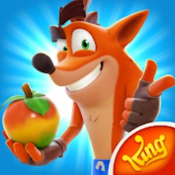

邦題：クラッシュ・バンディクー ブッとび！マルチワールド [Android版](https://play.google.com/store/apps/details?id=com.king.crash) [iOS版](https://apps.apple.com/jp/app/crash-bandicoot-on-the-run/id1510334752)

Kingはキャンディークラッシュサーガ・バブルウィッチなど主にパズルゲーム系で有名な会社だが、マップ画面の作成などで今までもHoudiniを使ってはいた。今回初の本格的３Dゲームをリリースし、Houdiniも本格的に使いだしたように見える。 [Kingのゲーム一覧](https://apps.apple.com/jp/developer/king/id526656015#see-all/i-phonei-pad-apps)

## 概要

https://www.youtube.com/watch?v=wx3lDVDIrqQ

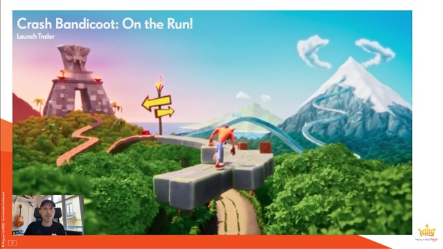

クラッシュバンディグー オン・ザ・ラン！ は開発のプロトタイピング作成や実際の背景製作の際、King内で初めて本格的にHoudiniを利用して作られリリースされたゲームです。
この動画では18か月にわたる、テク二カルとアートの密接な共同作業を促した知見の過程としてのツールの進化に注目します。さらにデータ方式とその考え方について、改善からの大きな変化にも注目します。
Miguel Mendez は2017年にKingに移籍してシニアテクニカルアーティストとして働き出す前、フライトシミュレーションの業界で9年の業務経験を持ち、そこでHoudiniを大スケールの背景データセット作成に利用していました。
Miguelは効果的なコンテンツパイプラインの製作に注力しました。前職での経験を利用し、プロシージャルワークフローがKing内のアートコンテンツがスケーラビリティを持てるようにしました。

## 動画アウトライン

### ゲームトレーラー

[00:01:14](http://www.youtube.com/watch?v=wx3lDVDIrqQ?t=74s)

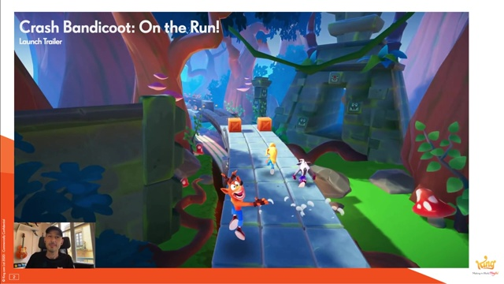

### ゲームのビジョン
[00:03:41](http://www.youtube.com/watch?v=wx3lDVDIrqQ?t=221s) 

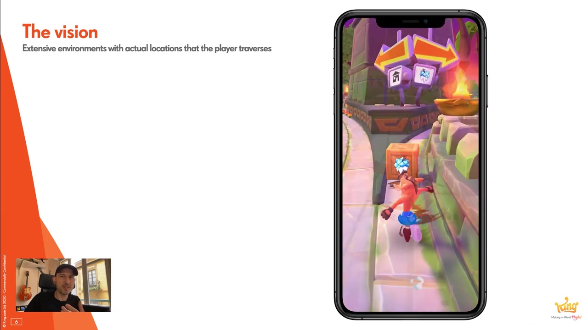

コンセプトアート。広大な情景の中に実際にプレイヤーが走り抜ける場所を設ける。

### 古典的な技法での試作

ハイトマップによる地形生成やUnityテレインは、我々がターゲットとするモバイルデバイスでは上手くワークしなかった。
製作フローは扱いづらく複雑で、ダウンロード時間、ファイル容量、コースモデルとのブレンド、地形のバラエティ、それぞれに問題があった。

### 様々な地形
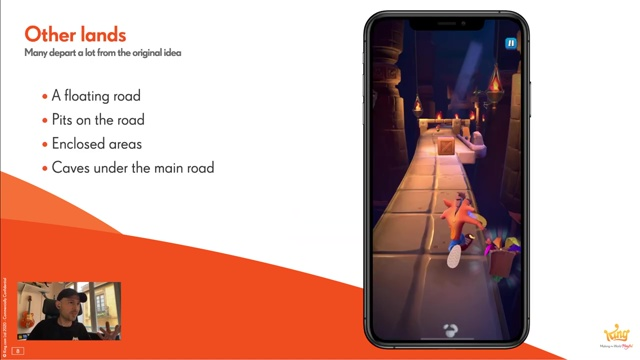

浮いた順路、穴の開いた順路、周りを囲まれた順路、地下洞窟など様々な誓いがあるため、オープンワールド向けの製作手法は相性が良くなかった。
全てを盛り込んだ地形データは巨大なものとなった。

### プロトタイプで試したこと
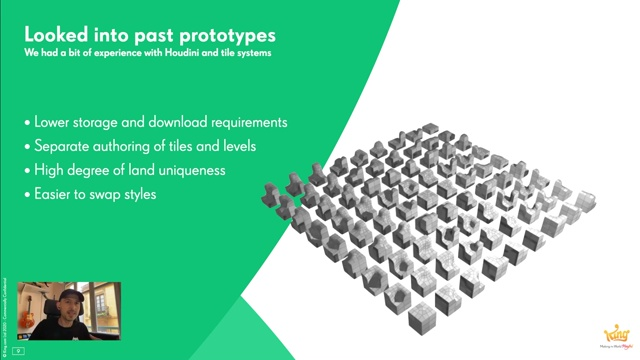

古典的な技法は上手くいかなかったため、他のゲーム製作で経験があったタイルシステムを利用してみる事にした。
相反する利点がさまざまにあった。モバイルデバイスにも向いており、ワークフローもシンプルだ。
今見ているタイルセットはHoudiniで作られている。

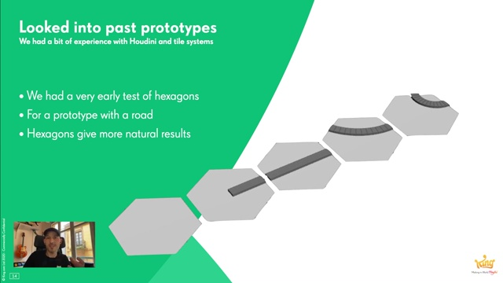

別のゲームでは六角形ベースのタイルセットも試していた。こちらのほうがよりナチュラルな形状の結果を得られる。
HoudiniのHDAでつくいられており、たった5つのパターンで順路を作成する事が出来ている。スプライン曲線ベースのツールも使いやすかった。

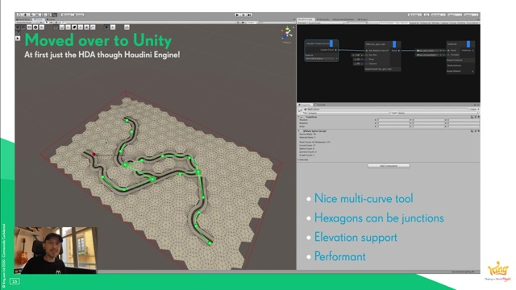

このツールをHoudiniエンジンを使い、Unity上で動くようにした。ジャンクションも作成でき、上下のコース変化も作れ、効率的である。
しかしアーティストや私が六角形タイルパーツをどう作るのかという問題があった。

### 六角形タイルシステムを導入
[00:06:07](http://www.youtube.com/watch?v=wx3lDVDIrqQ?t=367s) 

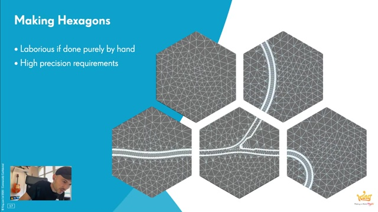

全てが手作業では辛すぎる。エッジ部分など、正確さが強く要求される。

### プロシージャル化しすぎて失敗
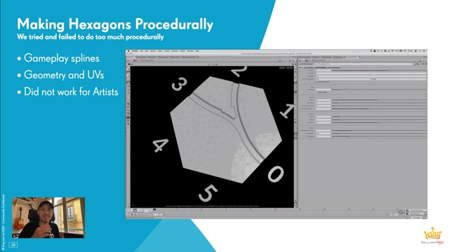

最初はHDAで作成。アーティストには受け入れられなかった。コンセプトアートに近づけなかった。

### アーティストのために六角形タイルを用意する
[00:12:15](https://www.youtube.com/watch?v=wx3lDVDIrqQ&t=735s) 

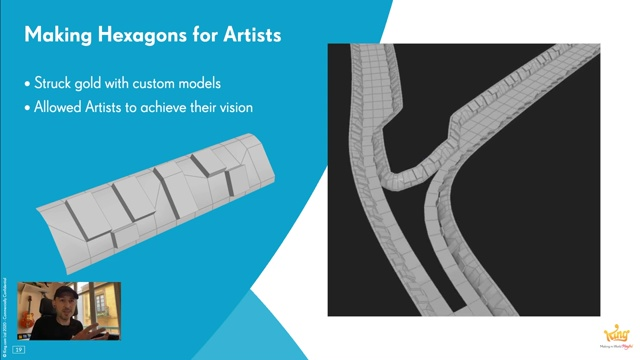

（路肩にカスタムモデルを適用している様子）
アーティスト手作業のモデルを六角形タイルに取り込むようにした。

### アーティストの作業を取り込む
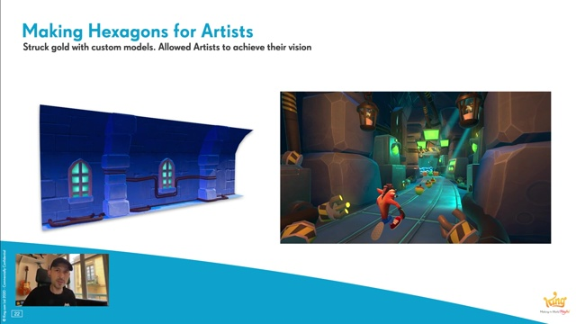

これは受け入れられた。この方法をどんどん拡張していった。ゲームに適用してみてもうまくいった。
様々なものを作っていった。六角形タイルを1つの巨大なモデルで囲む事もある。

### つまらない仕事を自動化する
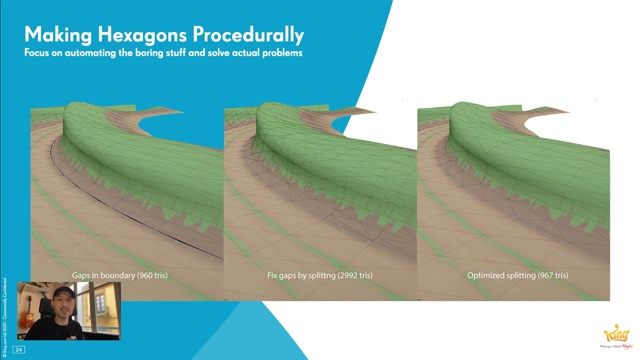

プロシージャルに作られた道と自由に作られた路肩をつないだ。Houdiniでどんな頂点情報も損なうことなく最適化する事ができた。

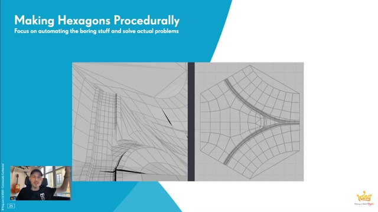

最終的には利用していないが、初期にあった課題を解決したHoudiniの活用例を紹介する。
当初の作りでは六角形タイルはハイトフィールドを持っていた。これをそのまま形状に適用するとゲームのキャラクターが走れない形状を作ってしまうので、
それを調整する値を予めHoudiniで計算して頂点のデータに格納し、頂点シェーダーがそれを利用するという例である。
スライドの右の図はハイト値をサンプルする座標をオフセットとした様子を視覚化した物である。

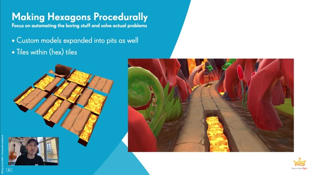

順路に存在する穴の生成にもカスタムモデルを利用できるようにした。タイルシステム内のタイルシステムである。
道もフルプロシージャルではなくなった。HDAにカスタムモデルを入力する。

### 新たに現れた問題の解決
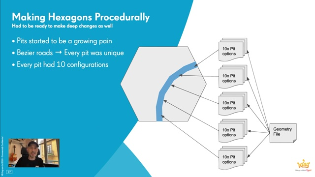

道のパーツ化は問題を作り出した。パーツはランタイムで変形はせず、あらかじめ順路のベジェカーブに合わせて曲げた物を作成しておく必要があった。
曲げたパーツはユニーク(個別形状)で、総パーツ数が増大した。制御するパラメータも増えた。毎日の変更にシステムがついてこなかった。

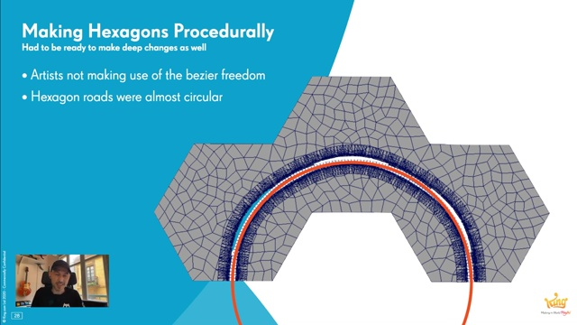

アーティストはベジェの自由度を利用できなかった。順路はたいていほとんどが明確に円形である。
ここに気づき、ベジェカーブベースをのコース設計をやめて円形ベースに変更したが、
この変更にすでに作られたアセットを調整するにあたってHoudiniがとても役にたった。

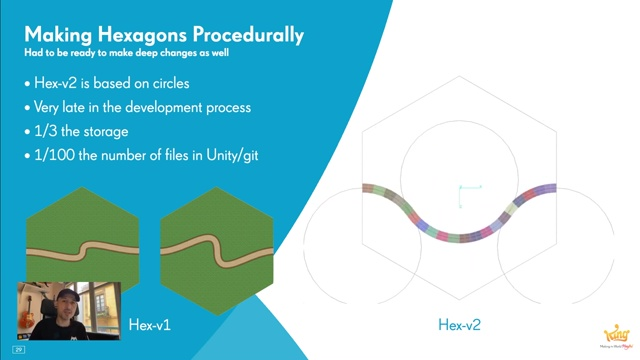

コースは３つの接する円によって形作られる。同じ曲率のパーツを反転まじえて配置する事でコースが成り立っている。
コースの曲率が一定になったので、パーツがユニークではなくなって総数を減らすことができた。結果、ファイル容量もファイルの総数も激減した。

### 最終結果
[00:24:07](https://youtu.be/wx3lDVDIrqQ?t=1447s) 

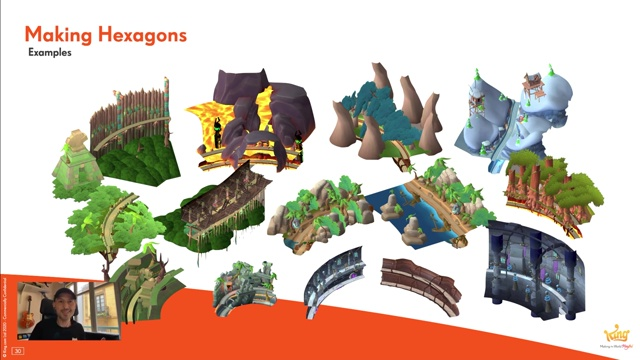

実際のタイル例。六角形タイルが背景チームの手により、路肩も飾られバラエティ豊かに変化した。

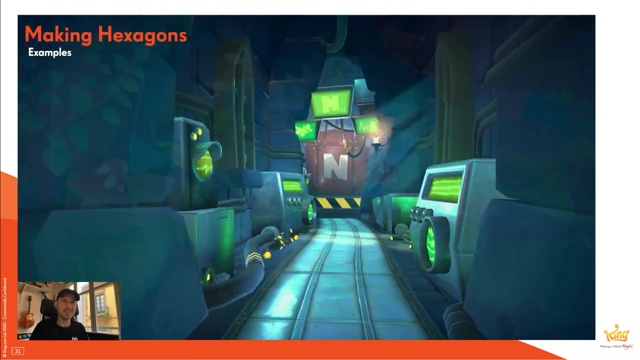

それらのタイルで作られた様々なシーンの動画。

## 補足

* 詳しい解説はなかったが、プロトタイプ以後もアーティストはHoudiniエンジンを介してUnity上でHDAを利用していると思われる。
